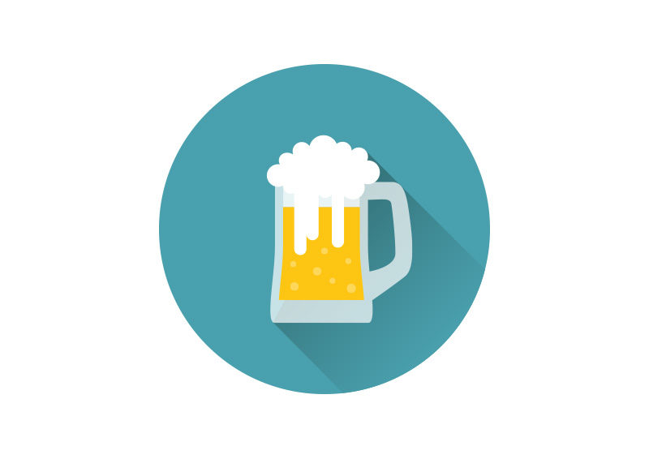
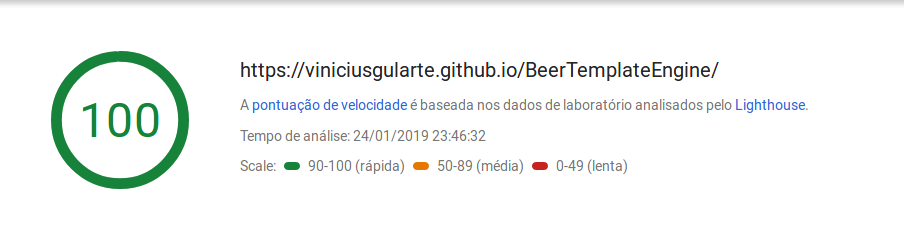

<p align="center">
  
</p>

## Beer Template Engine

### Creating your portfolio page has never been too easier. :beers:

##  [Example](http://viniciusgularte.surge.sh/)

#### Google PageSpeed Insights
<p align="center">
  
</p>

## Installation

**1. Clone this repo:**

```sh
git clone --depth 1 https://github.com/viniciusgularte/BeerTemplateEngine  my-app
cd my-app
```


**2. Make it your own:**

```sh
rm -rf .git && git init && npm init
```

> :information_source: This re-initializes the repo and sets up your NPM project.


**3. Install the dependencies:**

```sh
npm install && npm install - g surge
```

> You're done installing! Now let's get started developing.

## Starting create your portfolio card

**1. Change the variables in [user.js](https://github.com/ViniciusGularte/BeerTemplateEngine/blob/master/user.js)**

```javascript
 user: {
    site_title:'Vinicius Gularte Web Developer',
    name: 'Vinicius Gularte Martin',
    description: 'Developer from Brazil and writer in medium',
    github_url:  'https://github.com/ViniciusGularte',
    linkedin_url:'https://www.linkedin.com/in/viniciusgularte/',
    github_image:'https://avatars3.githubusercontent.com/u/25805846?s=460&v=4',
    site_name:'viniciusgularte',
}
```
**2. Run the build and server**

```sh
npm run build && surge
```
> Create an account with e-mail + password and provide the project patch (in public folder).

**3. Choose the domain**

> Put the name you want(Equal to variable site_name in **[user.js](https://github.com/ViniciusGularte/BeerTemplateEngine/blob/master/user.js)**)  follow by **.surge.sh**.

